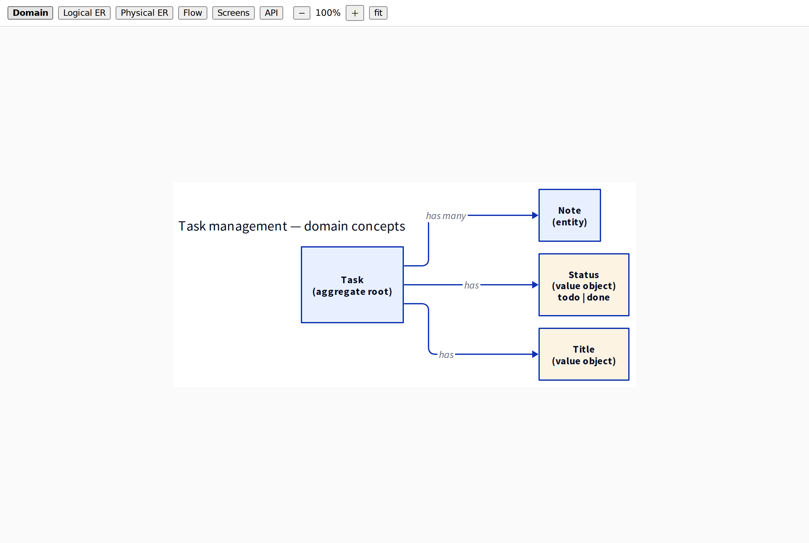
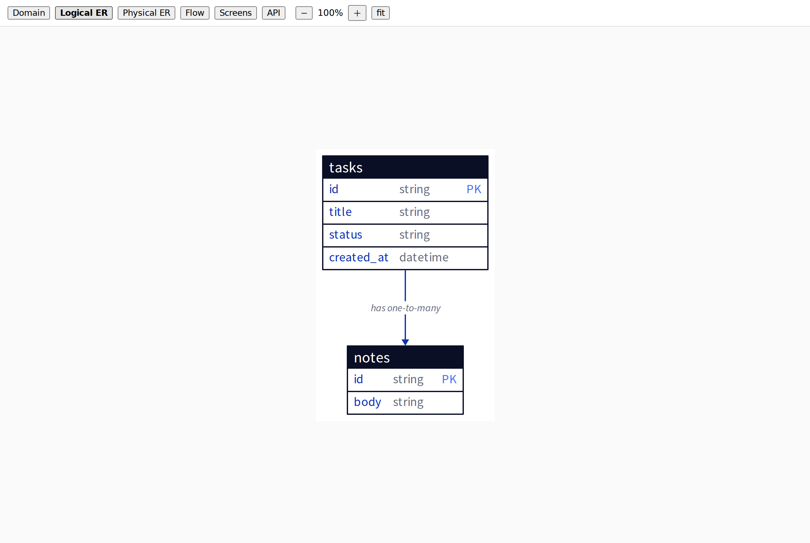
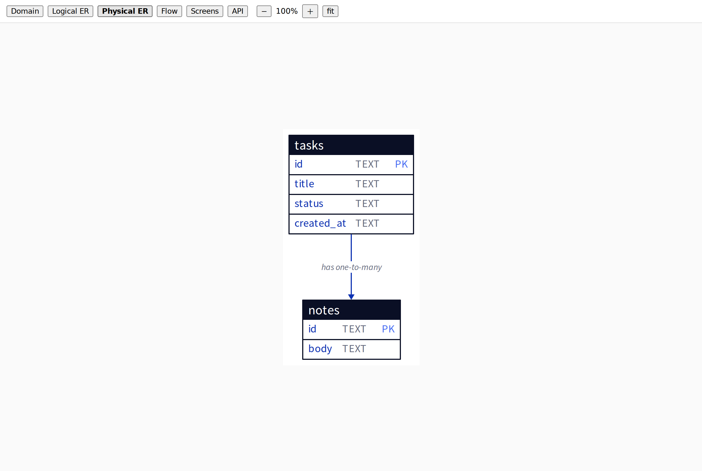
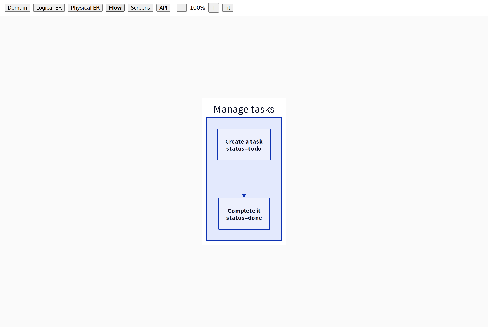
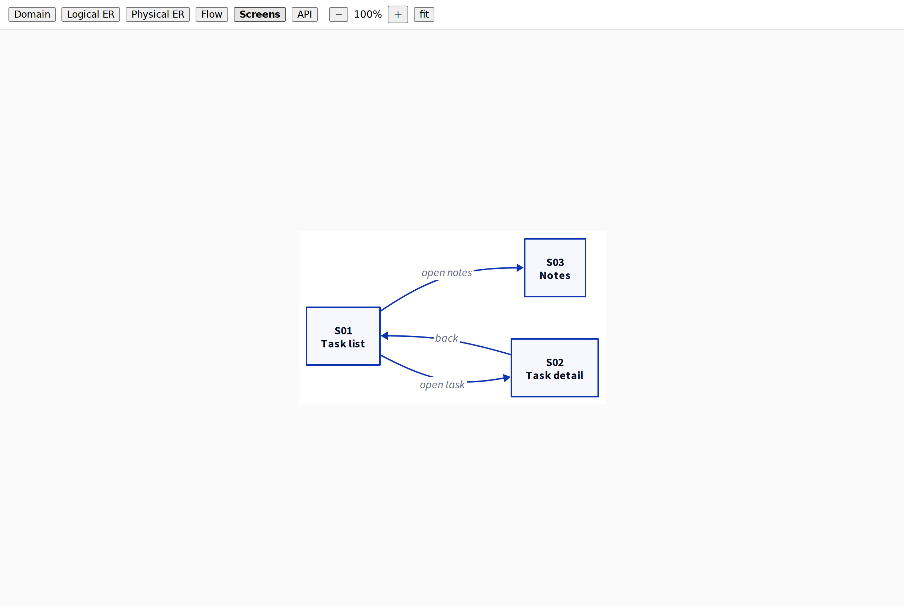
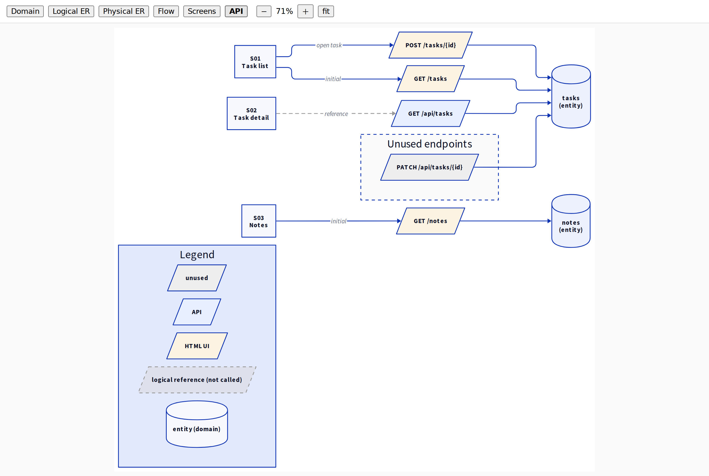

# domain-blueprint

Turn one model JSON into several design views — logical/physical ER, business flow,
screen navigation, and an API call map — then browse them in a local viewer.
Every generated view comes from the same source, so editing the model keeps all diagrams
in sync. A hand-written concept (domain) diagram can be shown alongside as a `static` view.

The installable agent skill lives in [`skills/domain-blueprint/`](skills/domain-blueprint/).
Its `SKILL.md` tells an agent how to install it into another project.

## Usage example

Generated from the dummy task-management model in
[`skills/domain-blueprint/examples/minimal`](skills/domain-blueprint/examples/minimal).
The viewer switches between every view, and each diagram comes from the same model.
Drag with the mouse to pan; use the zoom buttons or Ctrl/⌘ + wheel to zoom.

<table>
  <tr>
    <td align="center"><br><sub>Domain (hand-written concept diagram)</sub></td>
    <td align="center"><br><sub>Logical ER</sub></td>
  </tr>
  <tr>
    <td align="center"><br><sub>Physical ER</sub></td>
    <td align="center"><br><sub>Flow</sub></td>
  </tr>
  <tr>
    <td align="center"><br><sub>Screens</sub></td>
    <td align="center"><br><sub>API</sub></td>
  </tr>
</table>

Raw diagrams: [domain](docs/images/domain.svg) · [logical](docs/images/logical.svg) ·
[physical](docs/images/physical.svg) · [flow](docs/images/flow.svg) · [nav](docs/images/nav.svg) ·
[api](docs/images/api.svg)

## Install as an agent skill

```bash
npx skills add ANKM0/domain-blueprint
# or
gh skill install ANKM0/domain-blueprint
```

Then ask your agent to follow the skill. `skills/domain-blueprint/INSTALL.md` is a
ready-to-paste prompt.

## Run the example

```bash
cd skills/domain-blueprint
npm install            # or: bun install
node src/cli.ts build --config examples/minimal/domain-blueprint.config.json
node src/cli.ts serve --config examples/minimal/domain-blueprint.config.json
# open the printed URL
```

`build` validates the model, writes `*.d2`, compiles them with
[d2](https://d2lang.com) (must be on PATH), patches the SVGs, and writes `viewer.html`.
Node.js >= 22.6 strips TypeScript types; on 22.6–23.5 add `--experimental-strip-types`.

## Layout

- `skills/domain-blueprint/` — the skill and its resources:
  - `SKILL.md`, `AGENTS.md`, `INSTALL.md`, `README.md` (in this dir)
  - `src/` — CLI, config, model types, checks, renderers, viewer template, static server
  - `template/` — starter config, model, schema, and Taskfile fragment
  - `references/` — config, model, and adapter reference docs
  - `examples/minimal/` — a runnable example with an adapter and a hand-written `domain.d2`

## License

MIT
